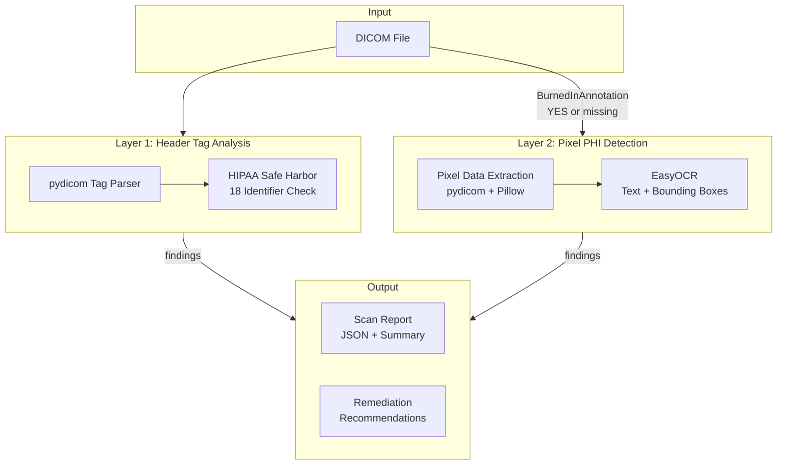

# DICOM PHI Scanner

Two-layer pipeline for detecting Protected Health Information (PHI) in DICOM medical imaging files. Scans both header tags and burned-in pixel text to identify PHI that must be removed before data sharing.

Built for healthcare data engineers who need to verify DICOM de-identification before inter-institutional data sharing or research use.

## Architecture



## How It Works

### Layer 1 — Header Tag Analysis (`dicom_phi_scan/tag_scanner.py`)
Parses DICOM metadata tags against the HIPAA Safe Harbor de-identification standard. Checks ~50 tags across categories:
- **Direct identifiers** (HIGH): Patient name, ID, birth date, address, phone
- **Institutional** (HIGH): Institution name/address, physician names, accession numbers
- **Temporal** (MEDIUM): Study/series dates and times
- **Device** (MEDIUM): Station name, device serial number
- **UIDs** (MEDIUM): Study/Series/SOP Instance UIDs

Common de-identification placeholders (ANONYMOUS, REDACTED, etc.) are filtered out to reduce false positives.

### Layer 2 — Pixel PHI Detection (`dicom_phi_scan/pixel_scanner.py`)
Detects PHI burned into pixel data (common in ultrasound, CR, secondary capture):
1. Extracts pixel data to image via `pydicom` + `Pillow`
2. Runs EasyOCR to extract text with bounding box coordinates and confidence scores
3. All detected text above the confidence threshold is flagged as potential PHI

### Scanning Pipeline (`dicom_phi_scan/scanner.py`)
1. Runs header tag scan
2. Checks `BurnedInAnnotation (0028,0301)` — if YES or missing, triggers pixel scan
3. Aggregates findings, computes overall risk level (HIGH / MEDIUM / LOW), and generates remediation recommendations

## Requirements

- Python 3.10+

## Quick Start

```bash
# Install (editable mode — code changes take effect immediately)
pip install -e .

# Scan a single file (summary to screen, JSON report to file)
dicom-phi-scan path/to/file.dcm -o report.json

# Batch scan a directory
dicom-phi-scan --dir path/to/dicoms/ -o results.jsonl

# Follow symlinks (e.g. for symlinked dataset subsets)
dicom-phi-scan --dir path/to/dicoms/ -L -o results.jsonl

# Limit number of files in batch mode
dicom-phi-scan --dir path/to/dicoms/ -L -o results.jsonl --limit 50

# Resume an interrupted batch scan (skips files already in output JSONL)
dicom-phi-scan --dir path/to/dicoms/ -o results.jsonl --resume

# Force CPU for OCR (GPU/CUDA is auto-detected by default)
dicom-phi-scan path/to/file.dcm -o report.json --cpu

# Query the JSONL report for HIGH risk files
jq 'select(.risk_level == "high") | .filepath' results.jsonl
```

## Banner Redaction

Beyond *detecting* PHI, the tool can *remediate* the burned-in header **banner** at the
top of ultrasound frames (e.g. Canon US), blacking it out across **all frames** and
writing **redacted copies** to a separate directory. **Originals are never modified.**

```bash
# Redact a single file (banner height derived from (0018,6011) if present)
dicom-phi-scan --redact-banner image.dcm --output-dir ./redacted

# Batch a directory (structure is mirrored under --output-dir)
dicom-phi-scan --redact-banner --dir ./series --output-dir ./redacted

# Set the banner height explicitly (rows from the top)
dicom-phi-scan --redact-banner --dir ./series --output-dir ./redacted --banner-height 80

# Keep output small and lossless (needs an encoder plugin: pip install '.[codecs]')
dicom-phi-scan --redact-banner --dir ./series --output-dir ./redacted --compress jpeg-ls
```

**How it decides what to do (auto method, per file):**
- *Uncompressed* files: the banner rows are overwritten directly in the pixel array;
  every other pixel is byte-identical to the original.
- *Compressed* files (e.g. a JPEG cine loop): frames are decoded, the banner is blacked
  out, and the result is re-encoded per `--compress`. JPEG decode is deterministic, so
  untouched pixels are pixel-identical to the original.
- Files with **no pixel data** are copied through unchanged so the output series stays complete.

**Key options:**
- `--banner-height N` — rows to black out. Optional when `(0018,6011)` *Sequence of
  Ultrasound Regions* is present (height = the topmost region's `RegionLocationMinY0`);
  required otherwise.
- `--compress {none,rle,jpeg-ls,jpeg2000,jpeg}` — output encoding for decoded frames.
  `none` (default) and `rle` are lossless with **no extra dependencies**; `jpeg-ls` /
  `jpeg2000` are lossless but need an encoder plugin (`pip install '.[codecs]'`); `jpeg`
  is lossy. A large uncompressed cine loop can be ~900 MB — use `--compress jpeg-ls` to
  keep it small **and** lossless.
- `--to-rgb` — convert YBR color frames to RGB on output (default: keep native color).
- `--force` — overwrite existing files in `--output-dir` (default: refuse).

Exit codes in redaction mode: `0` all files redacted/copied, `2` one or more errored.

> **Verify on real data (color space):** the one thing that can't be checked without your
> production files is whether the installed JPEG decoder hands pydicom the cine loop in
> **YBR** or already-**RGB**. After a first run, decode one redacted cine frame and confirm
> the banner is truly **black** and colors elsewhere look correct. If colors look wrong,
> re-run with `--to-rgb`.

## Python API

```python
from dicom_phi_scan.scanner import scan_file

report = scan_file("path/to/file.dcm")
print(report.risk_level)       # Severity.HIGH / MEDIUM / LOW
print(report.total_phi_count)  # number of findings
print(report.recommendations)  # list of action items
```

## Project Structure

```
dicom_phi_scan/
├── cli.py             # CLI entry point (dicom-phi-scan): scan + redaction modes
├── models.py          # Pydantic models (ScanReport, PHITagFinding, PixelPHIFinding, RedactionResult)
├── pixel_scanner.py   # Layer 2: OCR pixel text detection
├── redactor.py        # Banner redaction: black out the top banner, write redacted copies
├── scanner.py         # Orchestration pipeline
└── tag_scanner.py     # Layer 1: DICOM header tag analysis
```

## Design Decisions

- **Two-layer approach**: Header-only scanning misses burned-in annotations, which are common in ultrasound, CR, and secondary capture DICOM objects. Pixel analysis catches what tag scanning cannot.
- **Flag all OCR text as PHI**: Rather than attempting to classify burned-in text (which risks false negatives), all OCR-detected text is flagged as potential PHI. This conservative approach prioritizes patient privacy.
- **BurnedInAnnotation tag is checked but not trusted**: This tag is frequently missing or incorrectly set in real-world DICOM data. Pixel analysis still runs when the tag is absent.
- **Streaming batch output**: Batch scans stream per-file JSONL to disk and accumulate only lightweight stats in memory, avoiding OOM on large datasets.
- **Synthetic test data**: Real DICOM datasets from TCIA are already de-identified and don't exercise the PHI detection path. Synthetic data with planted fake PHI gives controlled, repeatable test cases.

## Stack

Python · pydicom · Pillow · EasyOCR · Pydantic

## License

MIT
